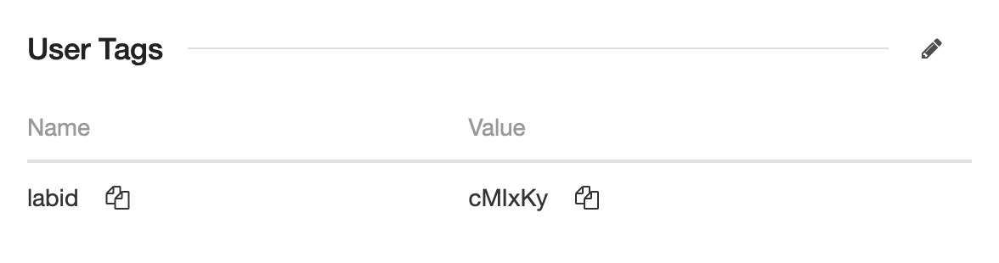

# F5xc UDF Lab Services

**These services are unusable outside of the F5 Universal Demo Framework (UDF) as they rely on the UDF metadata service.**

## tops-lab
This is the base service for all F5XC UDF labs.
The service kicks off automation to provision a user and F5XC resources in a target tenant.
These resources will remain in the tenant for the lifecycle of the UDF deployment + 5 minutes. 

### Actions performed
- [X] Pulls Deployment info from the UDF metadata service
- [X] Pulls Lab info from a f5xc-tenantOps S3 bucket
- [X] Creates a petname
- [X] Writes a state file for continuity between deployment start/stops
- [X] Sends an SQS message to kick off account and resource provisioning in F5XC
- [X] Continues sending SQSs to signify the deployment is active

### Requirements
The UDF deployment's "runner" instance must be must be tagged with the "labid":

### Installation
Run the [installer](./lab/tops_lab_install.sh) on the "runner" instance.

